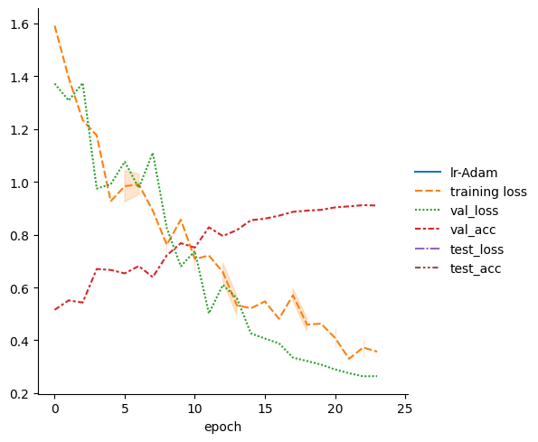
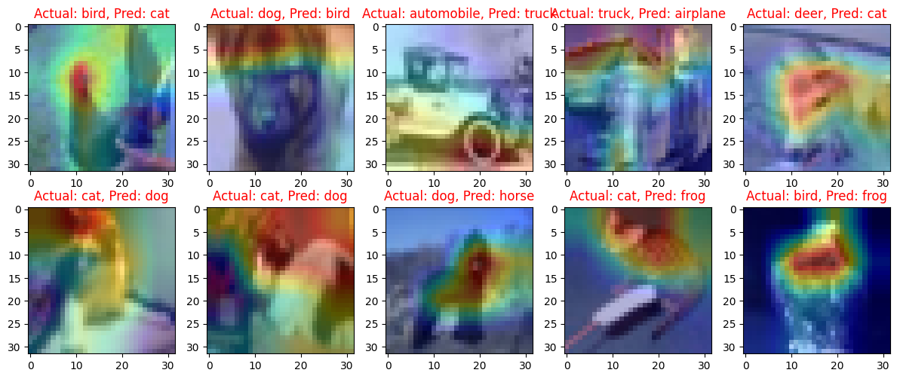
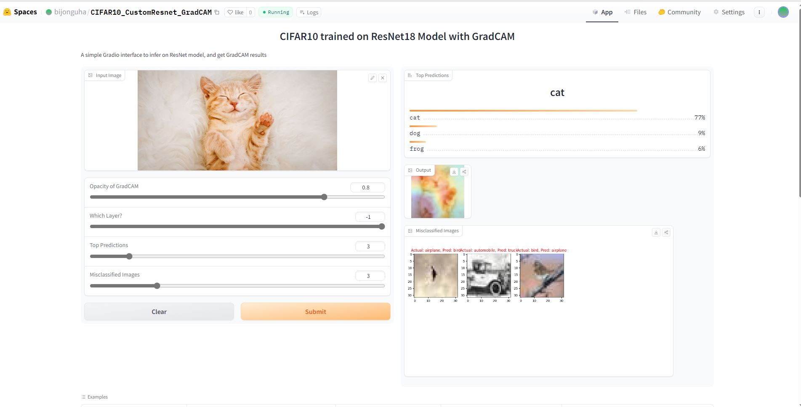

# Solution : TSAI_S12

## Problem Statement

    1. Move your S10 assignment to Lightning first and then to Spaces such that:  
        1. (You have retrained your model on Lightning)  
        2. You are using Gradio  
        3. Your spaces app has these features:  
            1. ask the user whether he/she wants to see GradCAM images and how many, and from which layer, allow opacity change as well  
            2. ask whether he/she wants to view misclassified images, and how many  
            3. allow users to upload new images, as well as provide 10 example images  
            4. ask how many top classes are to be shown (make sure the user cannot enter more than 10)  
        4. Add the full details on what your App is doing to Spaces README   
    2. Then:  
        1. Submit the Spaces App Link  
        2. Submit the Spaces README link (Space must not have a training code)
        3. Submit the GitHub Link where Lightning Code can be found along with detailed README with log, loss function graphs, and 10 misclassified images

## Introduction

The goal of this assignment is to design a Convolutional Neural Network (CNN) using PyTorch, PyTorch Lightning and the Albumentation library to achieve an accuracy of 85% on the CIFAR10 dataset. The code for this assignment is provided in a Jupyter Notebook, which can be found [here](./S12_ERA1.ipynb).

- The CIFAR10 dataset consists of 60,000 32x32 color training images and 10,000 test images, labeled into 10 classes. 
- The 10 classes represent airplanes, cars, birds, cats, deer, dogs, frogs, horses, ships, and trucks. 

## Resnet Architecture

- The custom ResNet model for CIFAR10 features a preprocessing layer, three primary layers, and a fully connected (FC) layer. 
- The layers incorporate Convolutional layers, MaxPooling, Batch Normalization, ReLU activations, and Residual Blocks to handle feature extraction and to mitigate the issue of vanishing gradients. 
- The model ends with a SoftMax function for class probability scores, leveraging the depth of the model and residual connections for efficient classification on the CIFAR10 dataset.

## ⚡ PyTorch Lightning Implementation

PyTorch Lightning provides a high-level interface to the PyTorch framework, simplifying many complex tasks and enabling more structured and cleaner code. It abstracts away most of the boilerplate code required for training, validation, and testing, allowing researchers and developers to focus on the actual model logic.

We wrapped our model using PyTorch Lightning module
- Data loading using PyTorch Bolt and Transformation using Albumentation
- Training, Validation and Test Steps
- One Cycle Learning Rate with Adam optimizer

## Results

The model was trained for 24 epochs and achieved an accuracy of 89.64% on the test set. 

## Misclassified Images with GradCAM

Few Samples of misclassified images,  

## Gradio App

For this project, a Gradio interface has been set up to let users interact with the trained CIFAR10 model. Users can upload images, adjust GradCAM parameters, and view the model's predictions along with GradCAM visualizations and misclassified images.

[Link](https://huggingface.co/spaces/bijonguha/CIFAR10_CustomResnet_GradCAM)

