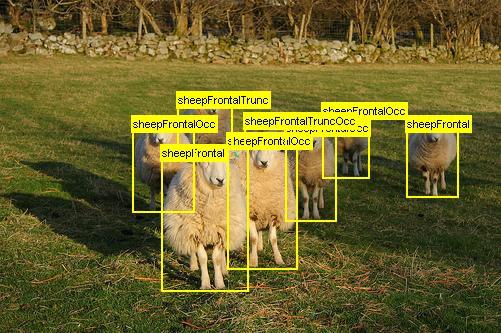

# Solution : TSAI_S13

## Problem Statement

    1. Move the code to PytorchLightning  
    2. Train the model to reach such that all of these are true:  
        1. Class accuracy is more than 75%   
        2. No Obj accuracy of more than 95%  
        3. Object Accuracy of more than 70% (assuming you had to reduce the kernel numbers, else 80/98/78)  
        4. Ideally trailed till 40 epochs  
    3. Add these training features:  
        1. Add multi-resolution training - the code shared trains only on one resolution 416  
        2. Add Implement Mosaic Augmentation only 75% of the times  
        3. Train on float16  
        4. GradCam must be implemented.  
    4. Things that are allowed due to HW constraints:
        1. Change of batch size
        2. Change of resolution
        3. Change of OCP parameters
    5. Once done:  
        1. Move the app to HuggingFace Spaces  
        2. Allow custom upload of images  
        3. Share some samples from the existing dataset  
        4. Show the GradCAM output for the image that the user uploads as well as for the samples. 
        5. Mention things like:  
            1. classes that your model support  
            2. link to the actual model  
    6. Assignment:
        1. Share HuggingFace App Link  
        2. Share LightningCode Link on Github  
        3. Share notebook link (with logs) on GitHub  

## Results

## 🎧 Gradio App

[Link](https://huggingface.co/spaces/bijonguha/yolov3-voc-era1)