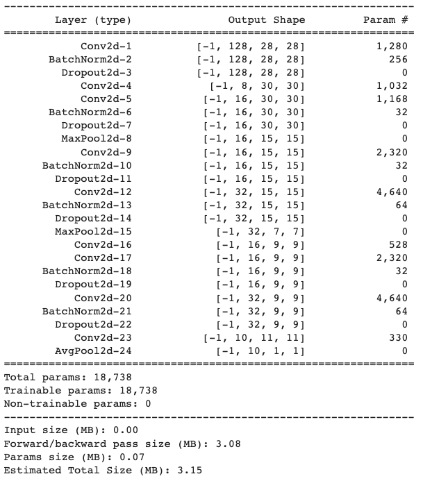

# Solution : TSAI_S6

## PART 2

### Objective  
Achieve 99.4% or more accuracy on mnist dataset with below constraints -
<li> Less than 20k parameters
<li> Less than 20 epochs
<li> Use Batch Normalization
<li> Use Dropout
<li> Fully connected layer, GAP are optional

## Model Summary
Here we have used 18,738 parameters in total and which is aligned with constraint of using less than 20k parameters

  
## Result
  
<li> Best Accuracy Test set : 99.43
<li> Epoch : 18
<li> Model Params : 18,738