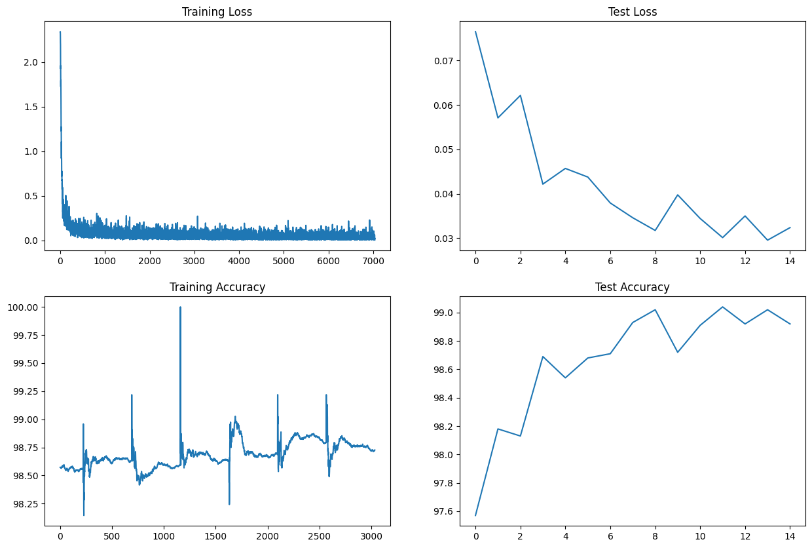
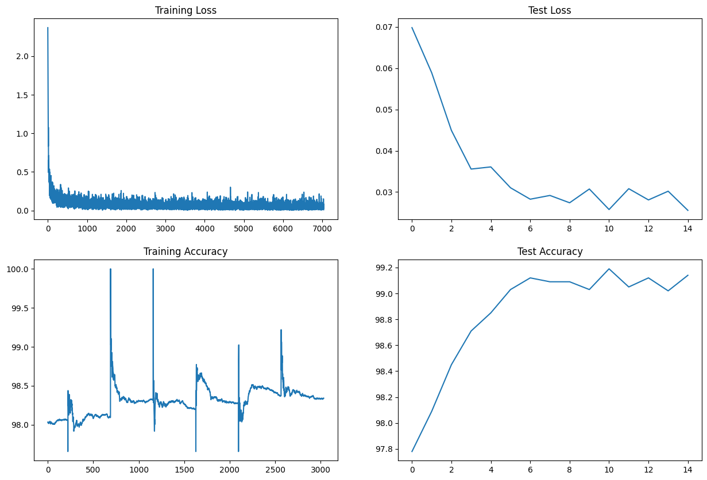
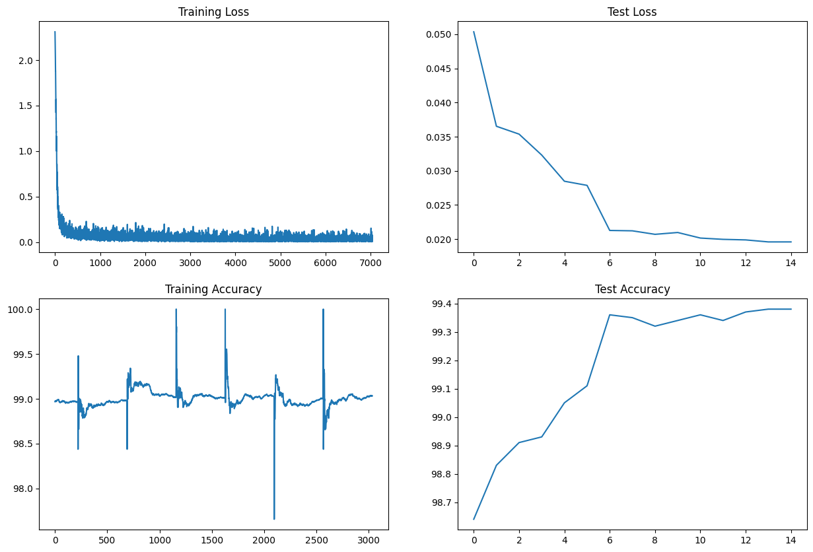
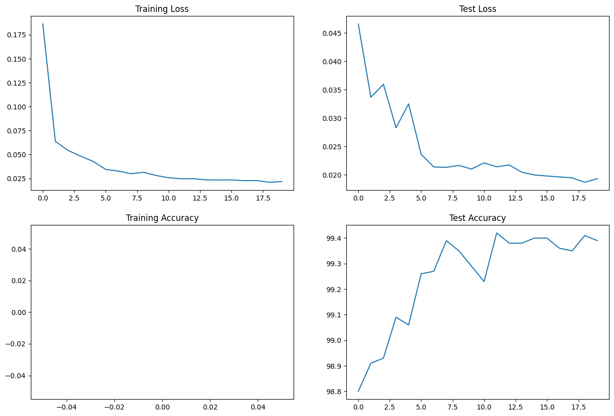

# Solution : TSAI_S7

## Solution, Step 1 [Notebook](./ERA1_S7_step1.ipynb)

### Target
- Creation of basic setup which includes dataset, data loader, train/test steps and required plots  
- Defining a first version model with Convolution block, GAP, dropout and batch normalization.

### Results
- Parameters: 6038
- Best Train Accuracy 98.79%  
- Best Test Accuracy 99.02%  

### Analysis
1. In 15 epochs, a model with 6K parameters could achieve up to 99.25% accuracy.
2. The model's training and test accuracies are comparable, hence it is not overfitting.

## Solution, Step 2 [Notebook](./ERA1_S7_step2.ipynb)

### Target 
- Adding image augmentation with random rotation and random affine to improve the model performance.

### Results
- Parameters: 6038
- Best Train Accuracy 98.33%  
- Best Test Accuracy 99.19%  

### Analysis
1. In 15 epochs, a model with 6K parameters could achieve up to 99.19% accuracy.
2. Image augmentation doesn't appear to have made significant contribution. Dropouts might be affecting this.

## Solution, Step 3 [Notebook](./ERA1_S7_step3.ipynb)

### Target 
- Study effect of including StepLR rate scheduler.
- Increase model capacity by increasing number of convolution layer.
- Optimize the learning rate and drop out value

### Results
- Parameters: 7416
- Best Train Accuracy 99.03%  
- Best Test Accuracy 99.38%  

### Analysis
1. In 15 epochs, a model with 7.4K parameters achieves 99.38% accuracy.
2. The model satisfies all epoch, accuracy, and size requirements.
3. LR rate scheduler and model capacity expansion helps achieve accuracy in 15 epochs.

## Solution, Step 3 [Notebook](./ERA1_S7_step4.ipynb)

### Target
- Improve accuracy to meet target.
- Use Squeeze-Expand model.
- LROnPlateau & Data Augmentation

### Results
- Parameters: 7356
- Best Train Accuracy 99.31%  
- Best Test Accuracy 99.46%  

### Analysis
1. Final Model