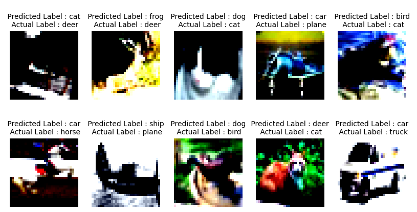
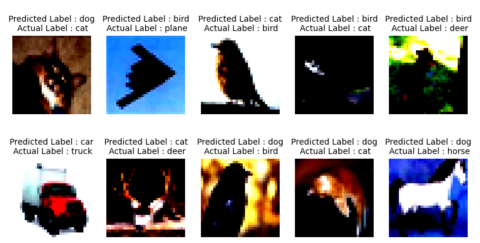

# Solution : TSAI_S7

## Problem Statement
Assignment is:  
  
1. Change the dataset to CIFAR10  
2. Make this network:  
    1. C1 C2 c3 P1 C3 C4 C5 c6 P2 C7 C8 C9 GAP c10  
    2. Keep the parameter count less than 50000  
    3. Try and add one layer to another  
    4. Max Epochs is 20  
3. You are making 3 versions of the above code (in each case achieve above 70% accuracy):  
    1. Network with Group Normalization  
    2. Network with Layer Normalization  
    3. Network with Batch Normalization  
4. Share these details  
    1. Training accuracy for 3 models  
    2. Test accuracy for 3 models  
    3. Find 10 misclassified images for the BN model, and show them as a 5x2 image matrix in 3 separately annotated images.  
5. write an explanatory README file that explains:
    1. what is your code all about,
    2. your findings for normalization techniques,
    3. add all your graphs
    4. your collection-of-misclassified-images 
6. Upload your complete assignment on GitHub and share the link on LMS

## Introduction

The goal of this assignment is to implement and evaluate the performance of a Convolutional Neural Network (CNN) with different normalization techniques on the CIFAR10 dataset. The network has a specific architecture (C1 C2 c3 P1 C3 C4 C5 c6 P2 C7 C8 C9 GAP c10 ) with the total parameter count kept under 50,000. "C" means 3x3 convoluion, "c" means 1x1 convolution, "P" means max pooling and "GAP" means global avaerag pooling. Network with skip connections.

Three versions of the network are created, each applying a different normalization technique: Group Normalization (GN), Layer Normalization (LN), and Batch Normalization (BN). Each model is trained for 20 epochs, and the goal is to achieve an accuracy of above 70% for each model.

## Data Augmentation 
Augmentation is performed using the Albumentations library. Three techniques are applied in the training data loader: horizontal flipping, shiftScaleRotate, and coarseDropout. No dropout was included in the model as these data augmentation methods provide similar regularization effects.

## Results
| Model | Notebook Link | Training Accuracy | Test Accuracy |
|-------|---------------|-------------------|---------------|
| Group Normalization | [GN Notebook](./S8_ERA1_GN.ipynb) | 64.23 % | 70.24 % |
| Layer Normalization | [LN Notebook](./S8_ERA1_LN.ipynb) | 65.41 % | 72.52 % |
| Batch Normalization | [BN Notebook](./S8_ERA1_BN.ipynb) | 67.36 % | 74.23 % |

## Findings
Batch Normalization achieved the highest training and test accuracies. Layer Normalization also performed well, with slightly lower accuracies. Group Normalization, however, yielded the lowest accuracies among the three techniques.

## Misclassified Images

### BN

### GN

### LN
